# Telecom Customer Churn Prediction
This project, conducted under PwC’s Data & Analytics Consulting Division, centers on addressing customer churn within a major telecom provider. It involves performing exploratory data analysis (EDA) and building machine learning models to forecast churn, ultimately delivering data-driven strategies aimed at enhancing customer retention and boosting profitability.

## Project Overview
- Objective: Understand customer behavior and main drivers that lead to customer churn

### Data description
- Data size: 7044 rows and 23 columns
- This dataset contains customer information from a telecom company, Each row represents an individual customer, with features covering demographics, account details, services subscribed, and support interactions. The key target variable is Churn, indicating whether a customer has discontinued the service
**Key Feature**
* customerID – Unique identifier for each customer.
* gender – Gender of the customer (Male/Female).
* SeniorCitizen – Indicates if the customer is a senior (1 = Yes, 0 = No).
* Partner – Whether the customer has a partner (Yes/No). 
* Dependents – Whether the customer has dependents (Yes/No).
* tenure – Number of months the customer has stayed with the company.
* PhoneService – Indicates if the customer has a phone service.
* MultipleLines – Whether the customer has multiple phone lines.
* InternetService – Type of internet service (DSL, Fiber optic, None).
* OnlineSecurity – Subscription to online security add-on (Yes/No).
* OnlineBackup – Subscription to online backup service (Yes/No).
* DeviceProtection – Subscription to device protection plan (Yes/No).
* TechSupport – Access to technical support services (Yes/No).
* StreamingTV – Subscription to streaming TV service (Yes/No).
* StreamingMovies – Subscription to streaming movies service (Yes/No).
* Contract – Type of contract (Month-to-month, One year, Two year). 
* PaperlessBilling – Indicates if the customer uses paperless billing. 
* PaymentMethod – Method of payment (Credit card, Bank transfer, etc.). 
* MonthlyCharges – Amount billed per month.                    
* TotalCharges – Total amount charged to the customer.
* numAdminTickets – Number of administrative support tickets raised.
* numTechTickets – Number of technical support tickets raised.
* Churn – Target variable showing whether the customer left (Yes/No).

### Data cleaning process:
* Convert TotalCharges to numeric
* Ensure MonthlyCharges, tenure, numAdminTickets, numTechTickets are numeric/integers.
* Impute TotalCharges with MonthlyCharges * tenure where available, else median.
* Impute binary/categorical Yes/No fields with mode.
* Validate that TotalCharges ≥ MonthlyCharges and tenure ≥ 0; flag/fix inconsistencies.
* Map binary fields to {0,1}.
* One-hot encode multi-class fields (Contract, PaymentMethod, InternetService).
* Feature engineering

## Results and findings
- **Churn rate**: The company has a relatively high customer churn rate of 26.5%, indicating that more than one in four customers discontinue their service.  
  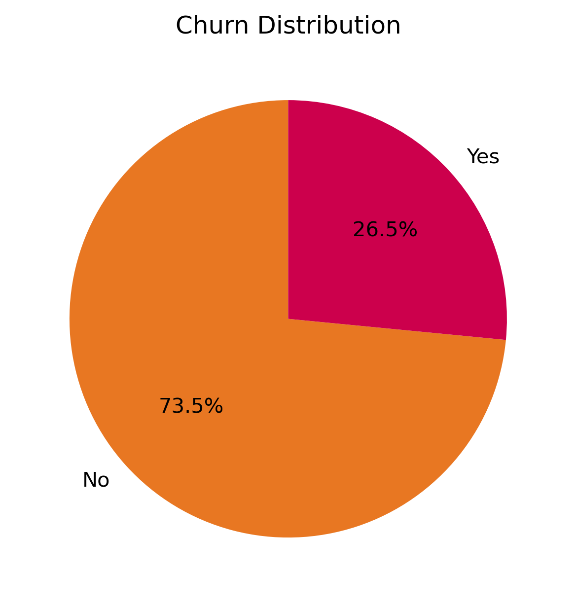

- **Contract type**: The company faces a high churn rate of over 40% among customers with month-to-month contracts, which is significantly higher compared to one-year and two-year contracts. This indicates that the longer the contract, the less likely customers are to churn.  
  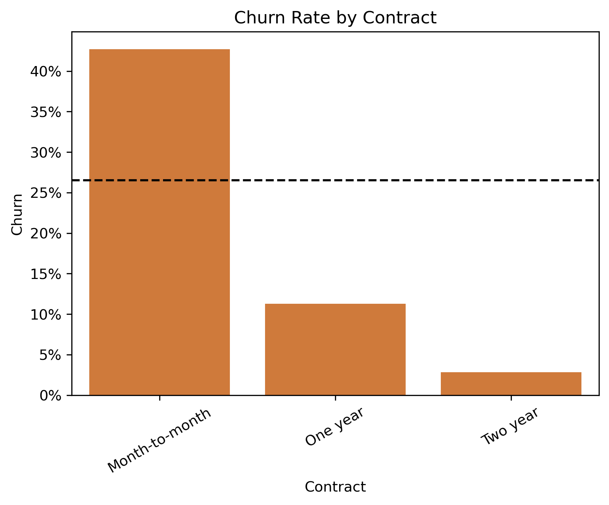

- **Dependents, Partner**: Customers without dependents or a partner show a higher churn rate of about 31%, compared to only 15% for those with dependents. This suggests that customers with dependents are more stable and loyal, while those without dependents are more prone to leaving.
  

    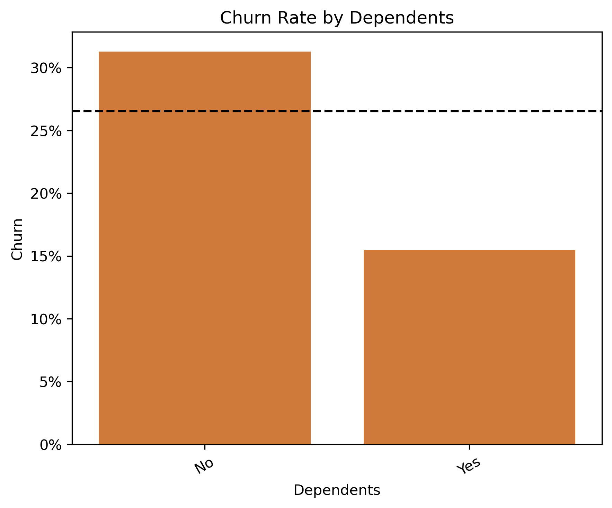
    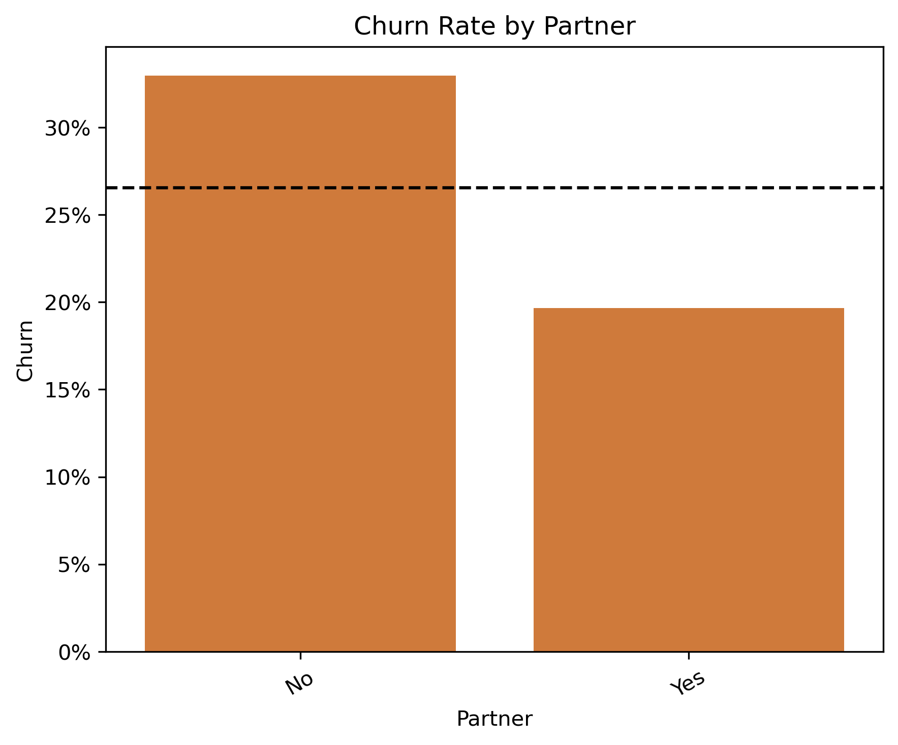
  

- **Internet Service**: Customers with Fiber Optic service have the highest churn rate at around 42%, well above the overall average. In contrast, those with DSL churn at a lower rate (19%), and customers with no internet service have the lowest churn (7%).
  

    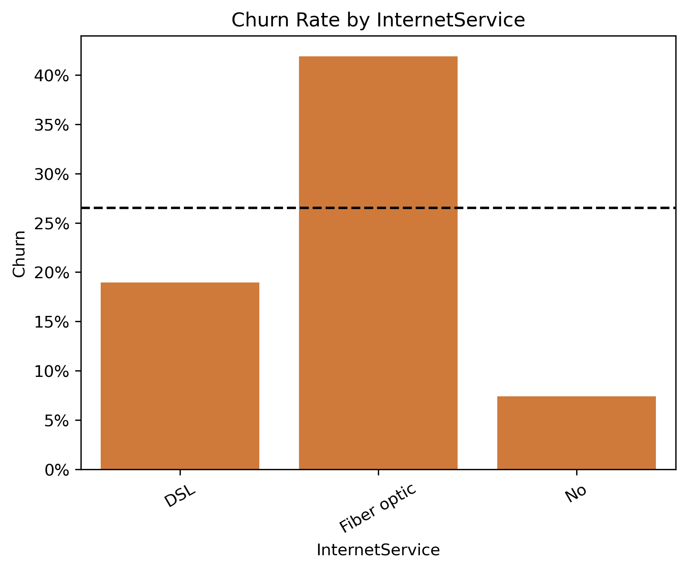
  

- **Online Backup, Security and Tech Support**: Customers without online backup, security, or tech support are more likely to churn, showing the value of those add-on services.
  

    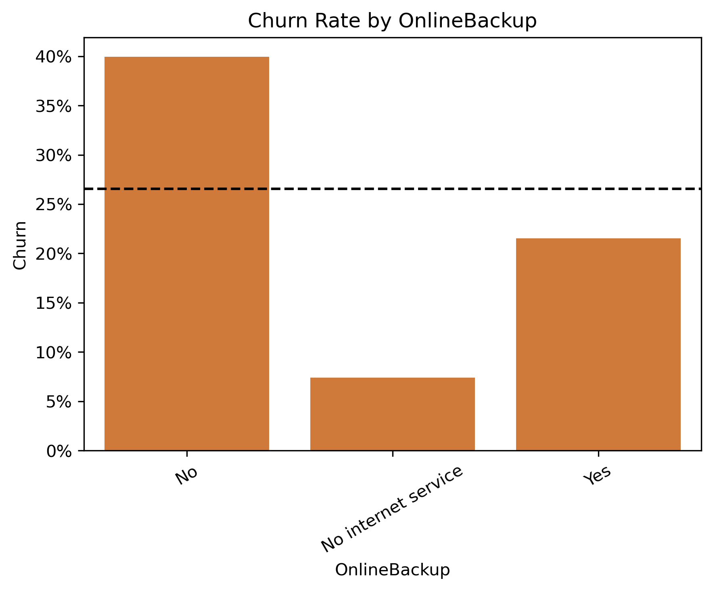
    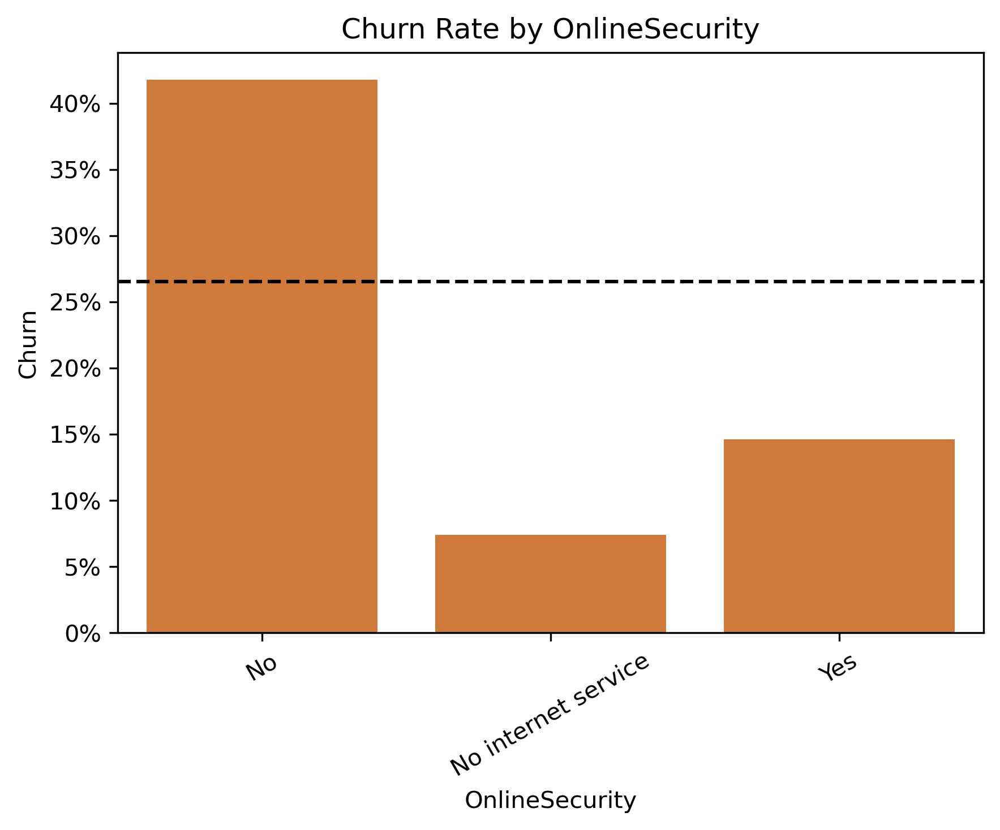
    
  

- **Billing and Payment Method**: Customer using electronic billing and payment method are significantly more likely to churn compare to low churn rate of automatic payment or traditional billing and payment method
  

    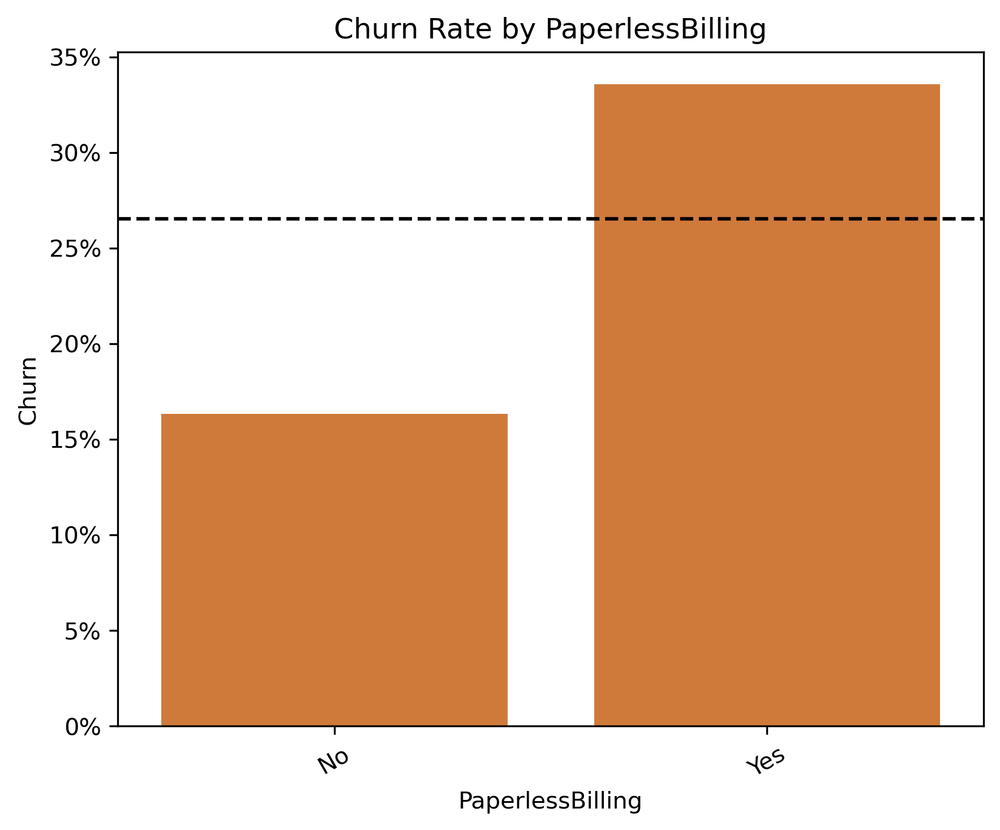
    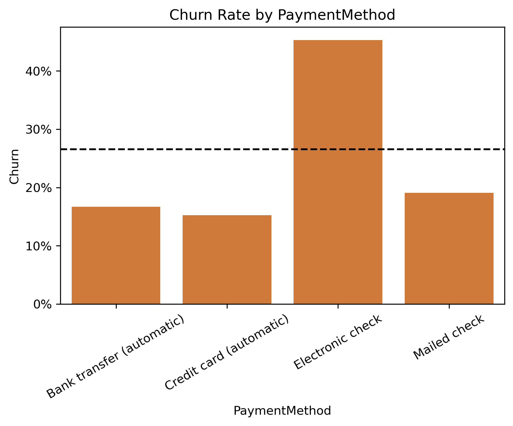
  

- **Tenure**: Customers with shorter tenure are much more likely to churn. Those in the 0–12 month group have the highest churn rate (48%), well above the average of 27%. Churn decreases steadily as tenure increases, with long-tenure customers.
  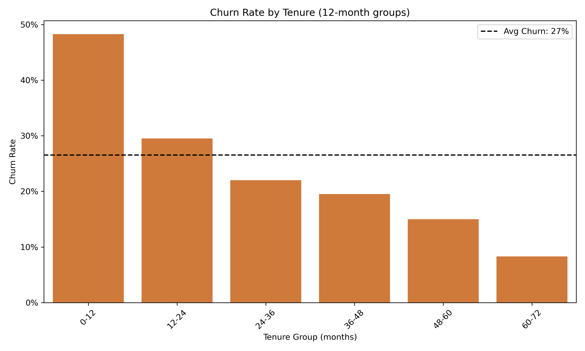
- **Monthly Charges**: Customers who churn generally have higher monthly charges, with a median of around $80, compared to about $65 for those who stay.

  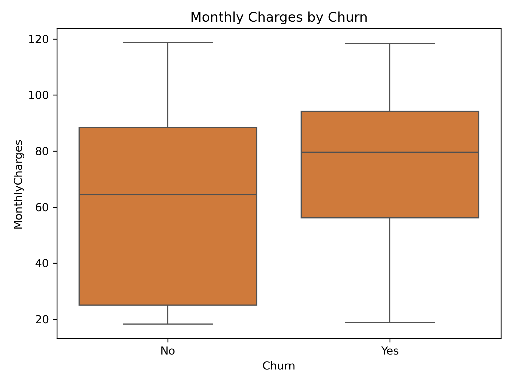

