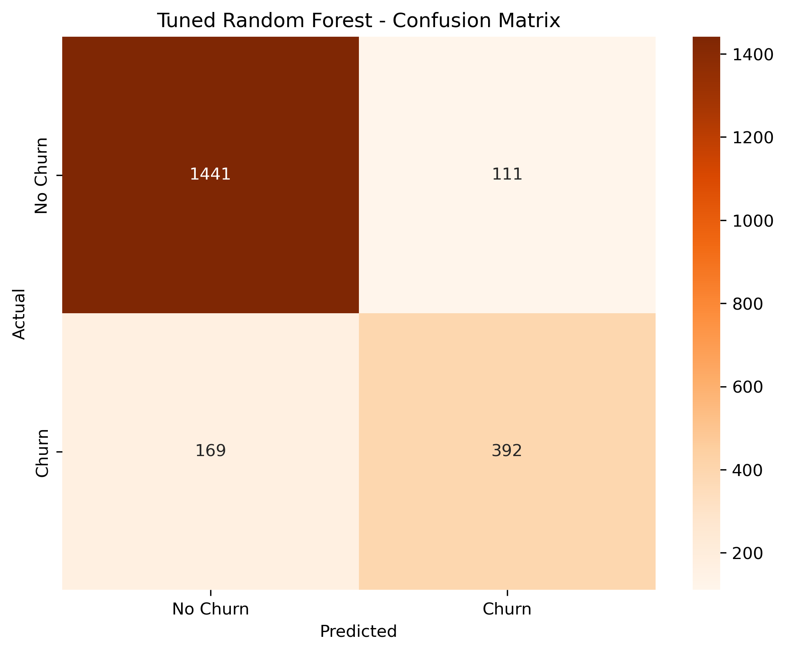
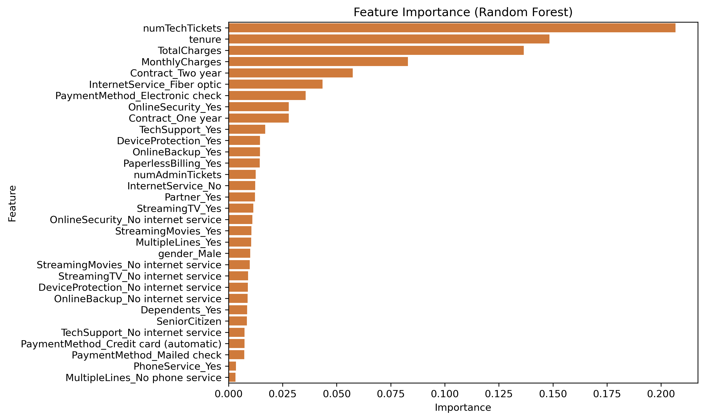

# Telecom Customer Churn Prediction
This project, conducted under PwC’s Data & Analytics Consulting Division, centers on addressing customer churn within a major telecom provider. It involves performing exploratory data analysis (EDA) and building machine learning models to forecast churn, ultimately delivering data-driven strategies aimed at enhancing customer retention and boosting profitability.

## Project Overview
- Objective: Understand customer behavior and main drivers that lead to customer churn

### Data description
- Data size: 7044 rows and 23 columns
- This dataset contains customer information from a telecom company, Each row represents an individual customer, with features covering demographics, account details, services subscribed, and support interactions. The key target variable is Churn, indicating whether a customer has discontinued the service
### **Key Feature**
* customerID – Unique identifier for each customer.
* gender – Gender of the customer (Male/Female).
* SeniorCitizen – Indicates if the customer is a senior (1 = Yes, 0 = No).
* Partner – Whether the customer has a partner (Yes/No). 
* Dependents – Whether the customer has dependents (Yes/No).
* tenure – Number of months the customer has stayed with the company.
* PhoneService – Indicates if the customer has a phone service.
* MultipleLines – Whether the customer has multiple phone lines.
* InternetService – Type of internet service (DSL, Fiber optic, None).
* OnlineSecurity – Subscription to online security add-on (Yes/No).
* OnlineBackup – Subscription to online backup service (Yes/No).
* DeviceProtection – Subscription to device protection plan (Yes/No).
* TechSupport – Access to technical support services (Yes/No).
* StreamingTV – Subscription to streaming TV service (Yes/No).
* StreamingMovies – Subscription to streaming movies service (Yes/No).
* Contract – Type of contract (Month-to-month, One year, Two year). 
* PaperlessBilling – Indicates if the customer uses paperless billing. 
* PaymentMethod – Method of payment (Credit card, Bank transfer, etc.). 
* MonthlyCharges – Amount billed per month.                    
* TotalCharges – Total amount charged to the customer.
* numAdminTickets – Number of administrative support tickets raised.
* numTechTickets – Number of technical support tickets raised.
* Churn – Target variable showing whether the customer left (Yes/No).

### Data cleaning process:
* Convert TotalCharges to numeric
* Ensure MonthlyCharges, tenure, numAdminTickets, numTechTickets are numeric/integers.
* Impute TotalCharges with MonthlyCharges * tenure where available, else median.
* Impute binary/categorical Yes/No fields with mode.
* Validate that TotalCharges ≥ MonthlyCharges and tenure ≥ 0; flag/fix inconsistencies.
* Map binary fields to {0,1}.
* One-hot encode multi-class fields (Contract, PaymentMethod, InternetService).
* Feature engineering

## Results and findings
- **Churn rate**: The company has a relatively high customer churn rate of 26.5%, indicating that more than one in four customers discontinue their service.  
  

- **Contract type**: The company faces a high churn rate of over 40% among customers with month-to-month contracts, which is significantly higher compared to one-year and two-year contracts. This indicates that the longer the contract, the less likely customers are to churn.  
  

- **Dependents, Partner**: Customers without dependents or a partner show a higher churn rate of about 31%, compared to only 15% for those with dependents. This suggests that customers with dependents are more stable and loyal, while those without dependents are more prone to leaving.
  

    
    
  

- **Internet Service**: Customers with Fiber Optic service have the highest churn rate at around 42%, well above the overall average. In contrast, those with DSL churn at a lower rate (19%), and customers with no internet service have the lowest churn (7%).
  

    
  

- **Online Backup, Security and Tech Support**: Customers without online backup, security, or tech support are more likely to churn, showing the value of those add-on services.
  

    
    
    
  

- **Billing and Payment Method**: Customer using electronic billing and payment method are significantly more likely to churn compare to low churn rate of automatic payment or traditional billing and payment method
  

    
    
  

- **Tenure**: Customers with shorter tenure are much more likely to churn. Those in the 0–12 month group have the highest churn rate (48%), well above the average of 27%. Churn decreases steadily as tenure increases, with long-tenure customers.
  
- **Monthly Charges**: Customers who churn generally have higher monthly charges, with a median of around $80, compared to about $65 for those who stay.

  

## Model training and evaluation
Four machine learning models were evaluated using accuracy, precision, recall, F1-score
| Model                     | Accuracy | Recall | Precision | F1-Score |
|----------------------------|----------|--------|-----------|----------|
| Tuned Logistic Regression | 0.86     | 0.92   | 0.90      | 0.91     |
| Tuned Decision Tree       | 0.85     | 0.92   | 0.88      | 0.90     |
| Tuned Random Forest       | 0.87     | 0.93   | 0.90      | 0.91     |
Best Model: The Tuned Random Forest offers the highest precision and robust performance, making it the optimal choice for churn prediction.

* **Feature importance:**

## Conclusion
The company is facing a churn rate of 26.5%, which is considered high for the telecom industry and signals underlying problems that must be addressed. A closer look at the data reveals several important patterns that shed light on customer behavior.

One of the strongest predictors of churn is contract length. Customers on month-to-month plans are the most volatile, with churn rates exceeding 40%. These customers lack long-term commitment and can easily switch to competitors, creating instability in the customer base. In contrast, those on one- and two-year contracts are far more stable, highlighting the importance of promoting longer-term plans.

Customer profile also plays a role. Those with dependents or partners tend to stay longer, suggesting that shared household usage increases loyalty. Meanwhile, customers without dependents are more prone to leave, perhaps because they are more flexible and less tied down.

Service type is another major factor. Interestingly, fiber optic customers churn at the highest rates, despite it being a premium service. This suggests that these customers are either more dissatisfied with service quality or more price-sensitive compared to DSL users. Similarly, customers who do not subscribe to add-on services such as online backup, security, or tech support are far more likely to churn, while those who adopt these services show significantly lower churn. These add-ons clearly increase stickiness and improve retention.

Billing and payment preferences also reveal surprising insights. Customers who opt for paperless billing or pay through electronic checks churn at much higher rates, while those using traditional billing or automatic payments via bank transfer and credit card show far greater loyalty. This suggests that while convenience is often valued, it may sometimes be linked to shorter-term, less committed customers.

Tenure and charges round out the story. Customers are most at risk in their first year, with churn nearing 50% in the first 12 months. The longer customers stay, the less likely they are to leave, reinforcing the importance of building strong engagement early in the relationship. Price sensitivity is also evident: customers on higher-priced plans churn more frequently, suggesting dissatisfaction with the perceived value of their service.

Taken together, the data highlights several critical churn drivers: contract length, tenure, add-on adoption, billing and payment methods, and monthly charges. To reduce churn, the company should focus on retaining early-stage customers, encouraging longer-term contracts, and promoting add-on services, while also addressing dissatisfaction among higher-paying fiber optic customers.
  

